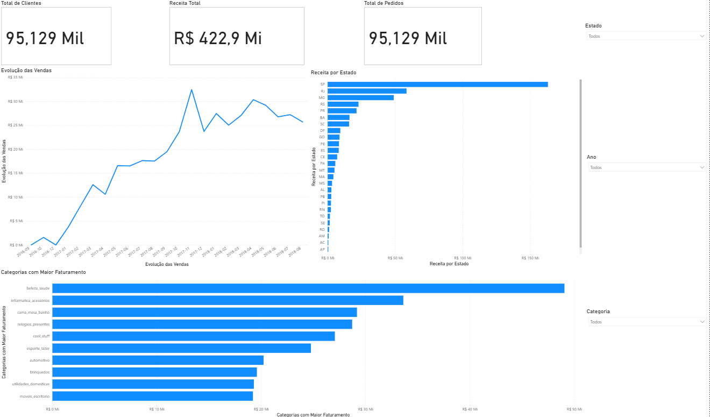
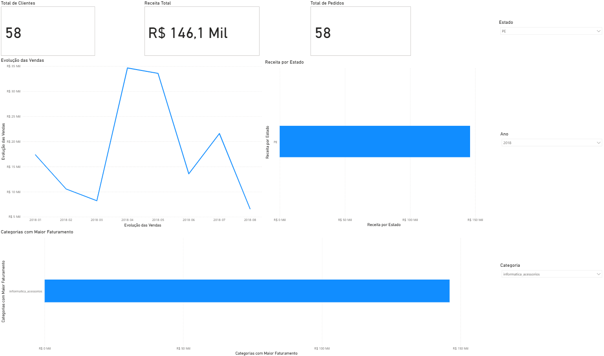

 📊 Dashboard de Vendas - Olist

Projeto de análise de dados desenvolvido com Python (Pandas) e Power BI utilizando o dataset público de e-commerce da Olist.

O objetivo do projeto foi analisar o desempenho de vendas, faturamento, clientes e categorias de produtos através de um dashboard interativo e visualmente organizado.

 🚀 Tecnologias Utilizadas

- Python
- Pandas
- Power BI
- CSV
- Visualização de Dados

 📁 Estrutura do Projeto

- `tratamento.py` → tratamento e transformação dos dados
- `> O arquivo `dados_tratados.csv` não foi incluído no repositório devido ao tamanho do dataset.
- `dashboard.pbix` → dashboard desenvolvido no Power BI
- `images/` → imagens do dashboard

 📊 Análises Realizadas

- Evolução das vendas ao longo do tempo
- Receita por estado
- Top 10 categorias com maior faturamento
- KPIs de:
  - Receita Total
  - Total de Clientes
  - Total de Pedidos
- Dashboard interativo com filtros por:
  - Estado
  - Ano
  - Categoria

# 💡 Principais Insights

- O estado de São Paulo lidera o faturamento entre os estados
- Houve crescimento significativo das vendas entre 2017 e 2018
- Categorias relacionadas à beleza e informática apresentaram destaque em receita
- O dashboard permite análises dinâmicas através dos filtros interativos

# 📸 Dashboard

## Dashboard Principal

## Dashboard Interativo

# 📦 Dataset Utilizado

Olist Brazilian E-commerce Public Dataset

Disponível no Kaggle.

# 👨‍💻 Autor

Eduardo Philype

LinkedIn:
https://www.linkedin.com/in/philypeferreira/

GitHub:
https://github.com/EPhilype
